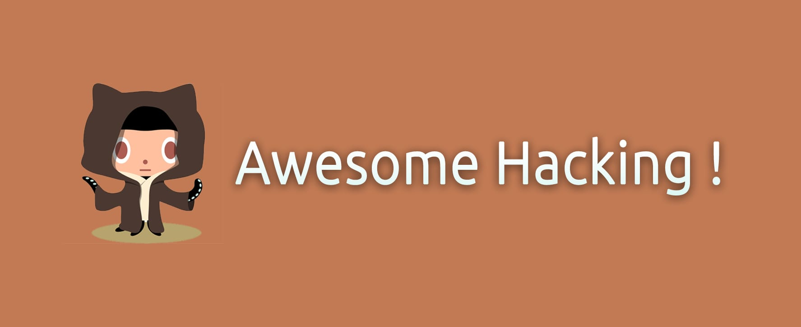

Awesome Tool Of The Day 
----------------------

#  List
* [Web-Application](https://github.com/briskinfosec/Awesome-Tool_of_the_Day/tree/main/Web%20Application%20Tools%20%26%20Checklist)
* [Mobile-Application](https://github.com/briskinfosec/Awesome-Tool_of_the_Day/tree/main/Mobile%20Application)
* [Network-Security](https://github.com/briskinfosec/Awesome-Tool_of_the_Day/tree/main/Network%20Security)
* [Forensics](#Forensics)
* [Binary-Analysis](#Binary-Analysis)
* [OSINT](#OSINT)
* [SCADA](https://github.com/briskinfosec/Awesome-Tool_of_the_Day/tree/main/Scada%20Security)

About Us
-----------------
**AUTHOR** - **Lakshmi Meti** , Security Engineer. Supported by BRISKINFOSEC BINTLABS"

**BINT LABS**

BINT LAB (Brisk Intelligence Laboratory) is the indigenous CoE (Center of Excellence) cybersecurity research lab of Briskinfosec.

Here, research and development is focused on making today’s systems more secure while planning for tomorrow’s technology.

Briskinfosec’s unique set of capabilities motivates us to focus on our cybersecurity research in various innovative technologies.

BINT LAB is empowered with in-house experts, volunteers, external security researchers and most talented cybersecurity professionals whom possess cult knowledge in the sector of information security.

We have conglomerated a vast library of resources containing Blogs,

Whitepapers and security assessment tools to help in managing and creating smart cybersecurity solutions.

**Briskinfosec's BINT LAB achievements:**

* Briskinfosec BINT LAB won the INDIAN BOOK OF RECORDS for Cybersecurity initiative.

* ANSE (Advanced Nmap Scripting Engine) scanner for network security assessment.

* Created and published NCDRC MAST (National Cyber Defence Research Center Mobile App Security Test) frameworks.

* Researchers are actively participating in Bug Bounty and Hall of Fame events.

**Inviting Research Collaboration:**

If you are a Individual, University or an Organization looking forward to build or to collaborate on Cybersecurity Research process,you can send your proposal contact@briskinfosec.com 

